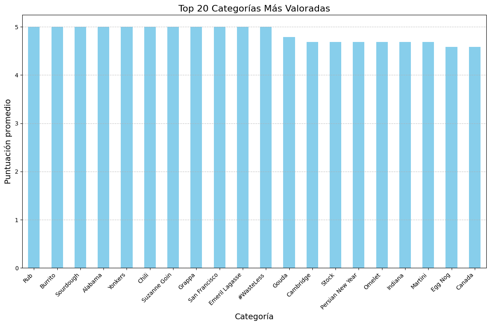
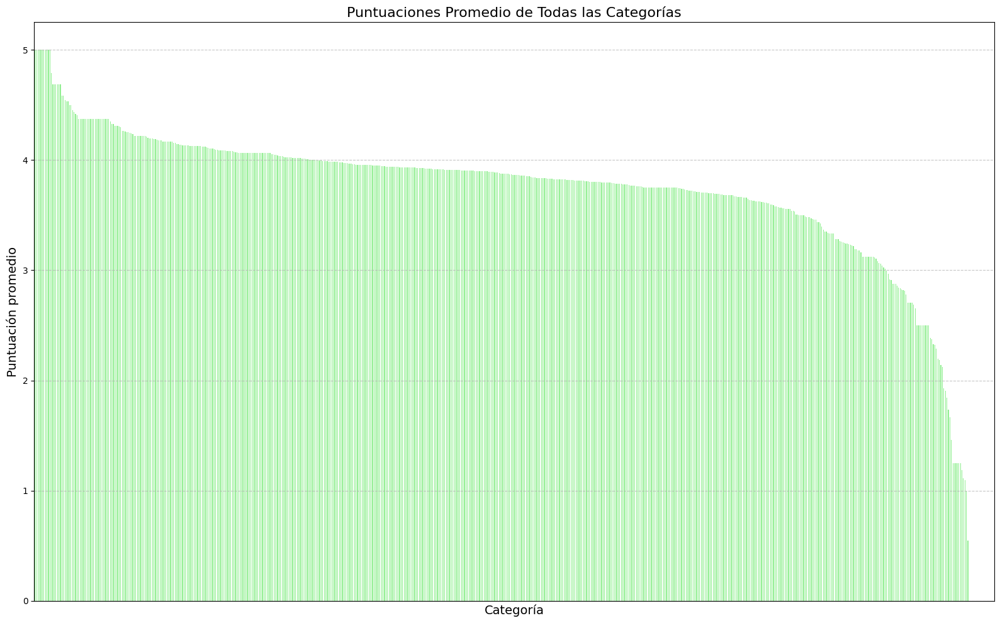

# Proyecto Final: Tratamiento de Datos 2024/25 (Convocatoria Extraordinaria)

## Autor
Miguel González Martínez (100451423)

# Análisis de Recetas y Predicción de Calificaciones con NLP y ML

Este repositorio consiste en la extensión del proyecto realizado anteriormente en la convocatoria ordinaria con el objetivo de, no solo revisar, comparar y mejorar el proyecto base planteado anteriormente, sino incluyendo además el apartado de extensión (que no estaba incluido en la convocatoria ordinaria). Concretamente, se utiliza técnicas avanzadas de Procesamiento de Lenguaje Natural (NLP) y modelos de aprendizaje automático de un conjunto de datos que servirá para analizar y predecir calificaciones de recetas basadas en características textuales y datos numéricos. 

## Descripción del Proyecto

Los objetivos principales del proyecto extendido son:
  1. Preprocesar y extraer características significativas de los textos y metadatos de las recetas.
  2. Experimentar con múltiples representaciones de texto (TF-IDF, Word2Vec y BERT) para la extracción de características.
  3. Construir y evaluar modelos predictivos para las calificaciones de las recetas.
  4. Comparar el proyecto base anterior con el nuevo proyecto base actualizado, corrigiendo algunos errores de metodología usados anteriormente.
  5. Extender el proyecto utilizando y relacionando no solo 

## Conjunto de Datos

El archivo JSON proporcionado incluye 20,130 entradas con información sobre recetas (instrucciones, categorías, descripciones, `rating`). La tarea principal es predecir la variable `rating` usando otras variables textuales y numéricas como entrada.

## Características

- **Preprocesamiento de Texto**: Uso de `spaCy` para tokenización, lematización y eliminación de palabras vacías.
- **Ingeniería de Características**:
  - Vectorización con TF-IDF
  - Embeddings con Word2Vec
  - Embeddings contextuales con BERT
- **Modelos de Aprendizaje Automático**:
  - K-Nearest Neighbors (KNN)
  - Redes Neuronales (NN)
- **Extensiones**
  - Uso de un summarizer preentrenado (con pipelines de Hugging Face) para proporcionar un resumen de la variable 'directions', la cual es una lista de instrucciones que puede contener textos relativamente grandes así como pasos repetidos.
  - Estudiar la capacidad de los modelos de tipo transformer para la generación de nuevas recetas en tiempo real (Kafka), comparando las prestaciones de esto respecto a su implementación con técnicas de prompting sobre modelos del lenguaje de uso libre (LLAMa, Mixtral, etc.).
  - Explorar el potencial de técnicas de NLP como el uso de bigramas, part-ofspeech tagging, tesauros, etc., (explotando la funcionalidad disponible en la librería NLTK de Python).
  - Comparación de prestaciones utilizando distintos embeddings contextuales.
  - Visualización y análisis empleando técnicas basadas en grafos.

## Cambios con respecto a la estructura de archivos del proyecto base de la convocatoria ordinaria

Con respecto a la estructura del proyecto, habíamos implementado una serie de archivos .ipynb, con una V4 de un intento fallido de implementar una cabeza de regresión con un modelo pre entrenado BERT para clasificación, y una serie de archivos V3 para dar con los resultados finales, teniendo en cuenta diferente conjunto de datos:
  - AllData: Utiliza todos los datos de texto (instrucciones, categorias, descripciones, titulo) asi como numericos (calorías, grasas etc.)
  - OnlyTextdata: Utiliza solamente los datos de texto como la categoría anterior.
  - OnlySomeTextData: Utiliza solamente las columnas de instrucciones y descripciones.
  - Directions: Solo utiliza las instrucciones.
  - Descriptions: Solo utiliza las descripciones de las recetas.

A diferencia del proyecto base, (que contenía múltiples archivos `Jupyter Notebook` con código redundante), esta versión sigue una estructura modular en Python, dividiendo las funcionalidades en diferentes archivos `.py` con argumentos configurables:

```
proyecto_nlp_ml/
│── data/		# Conjunto de datos
│── src/		# Código fuente
│   ├── preprocess.py  # Preprocesamiento de texto
│   ├── feature_engineering.py  # Ingeniería de características
│   ├── model.py  # Entrenamiento y evaluación de modelos
│   ├── visualization.py  # Análisis y visualización de datos
│── notebooks/	# Notebooks para análisis exploratorio
│── results/	# Resultados de experimentos y modelos entrenados
│── main.py	# Script principal con parámetros configurables
│── requirements.txt  # Dependencias del proyecto
│── README.md	# Documentación del proyecto
```


## Métricas utilizadas anteriormente, y nuevas métricas

En nuestro proyecto, hemos usado la MAE para identificar el rendimiento del regresor, ya que denota cuanto se desvía, en promedio, la magnitud de los errores entre los valores que se han predecido, y los valores reales. En nuestro caso, nos salió de forma general un valor numérico de 0.828418629242508, que indica que, en promedio, las predicciones del regresor tienen un error absoluto de 0.828418629242508 respecto a los valores reales.

## Limpieza de datos

En primer lugar se ha limpiado la base de datos de todos los valores NA que contenía, eliminando asi todas las recetas que contienen un NA tanto numerico como de texto, reduciendo el número de recetas a 10.000. Esto es conveniente a primeras debido a que el tiempo de procesamiento de todo el fichero de datos JSON es muy elevado, lo que permite la ejecución en local de este problema con la GPU.

## Preprocesado

Se ha preprocesado el texto para las vectorizaciones que lo necesiten como TF-IDF, mientras que para el preprocesado del texto se ha usado spacy con el modelo 'en_core_web_sm'

## Vectorizado

Despues se procede a la vectorización de los datos con los 3 modelos:
- TF-IDF
- W2V
- Bert: Se ha utilizado una max_leght de 64 para evitar colapsar la memoria de los ordenadores


## Modelos utilizados
Se han utilizado varios modelos para medir el rendimiento de los vectorizadores:

- KNN: de scikit learn

- Red neuronal simple: La red SimpleNN es una red neuronal completamente conectada con una capa oculta de 128 neuronas y activación ReLU, seguida de una capa de salida con 1 neurona. Es adecuada para tareas simples de regresión o clasificación binaria. Su estructura permite procesar entradas de tamaño definido por input_size.

- Red neuronal compleja: La red ComplexNN es una red neuronal profunda y configurable con múltiples capas ocultas (por defecto 256, 128 y 64 neuronas). Cada capa incluye activación ReLU, normalización BatchNorm, y Dropout para regularización. Es adecuada para tareas más complejas de regresión o clasificación, permitiendo personalizar tanto el tamaño de las capas ocultas como la tasa de dropout.

- Red Bert pre entrenada de hugging face

## Resultados

### Visualización de Categorías de Recetas
- **Top 20 Categorías Más Valoradas**:
  

- **Puntuaciones de Todas las Categorías**:
  

Es interesante observar que la mayoría de categorías tiene una media similar, que la desviación típica de los datos es menor que 1 y la mediana es muy estable. Podemos observar que exhibe un pico más alto y colas más pesadas en comparación con la distribución normal, lo que indica una distribución leptocurtica, lo que significa que los datos tienen una mayor concentración alrededor de la media y valores más extremos en las colas.

### Otros resultados acerca del Modelo


### Rendimiento de los Modelos

El rendimiento de los modelos se puede observar los excels. Hay un excel que recopila todos los datos(Resultado Datos), mientras que (Comparacion entre vectorizaciones) ayuda a comparar el rendimiento de las vectorizaciones dependiendo de los datos de entrada mencionados anteriormente.

Aqui podemos ver los resultados para la red neuronal compleja:

| Model  | ALL DATA    | ONLY TEXT DATA | SomeTextData | Directions  | Descriptions |
|--------|-------------|----------------|-------------|-------------|--------------|
| W2V    | 0.729761541 | 0.72748363     | 0.70285362  | 0.72418654  | 0.7309196    |
| TF-IDF | 0.678939462 | 0.663268507    | 0.686691642 | 0.695839405 | 0.697468162  |
| BERT   | 0.711494803 | 0.644052863    | 0.690597415 | 0.720204115 | 0.697323203  |


Se pueden observar diversos patrones al cambiar de datos

 La MAE del modelo bert pre entrenado con fine tunning resulta en una MAE de 2.82. Este resultado es la media -1, ya que el predictor siempre ha tenido como salida 1, y por tanto el MAE es la media -1.
 Esto sucede porque el modelo esta prediciendo siempre uno, lo que nos indica que la cabeza de regresion no se ha implementado correctamente.

## Conclusión


Los mejores resultados parecen ser obtenidos por BERT cuando se utilizan los datos adecuados. Es probable que un mejor rendimiento se logre aumentando el max length de BERT, siempre que se disponga de un equipo más potente.

Por otro lado, ampliar aún más la red neuronal compleja podría también mejorar su rendimiento. En contraste, la red KNN resulta poco expresiva al manejar grandes volúmenes de datos.

## Herramientas y Librerías Usadas del Proyecto

- **Procesamiento de texto:** NLTK, SpaCy, Transformers.
- **Aprendizaje Automático:** PyTorch, Scikit-learn. (Otra alternativa sería usar PySpark)
- **Validación de Datos:** Pydantic.
- **Visualización:** Matplotlib.

## Bibliografía

### Documentación y herramientas utilizadas

1. **Python**: Lenguaje base del proyecto.
   - [Python Documentation](https://docs.python.org/3/)

2. **Jupyter Notebooks**: Para exploración interactiva.
   - [Jupyter Documentation](https://jupyter.org/documentation)

3. **PyTorch**: Framework de deep learning.
   - [PyTorch Documentation](https://pytorch.org/docs/)

4. **Scikit-learn**: Algoritmos clásicos de machine learning.
   - [Scikit-learn Documentation](https://scikit-learn.org/stable/documentation.html)

5. **Hugging Face Transformers**: Fine-tuning de modelos.
   - [Hugging Face Documentation](https://huggingface.co/docs/transformers/)

6. **Jupytext**: Conversión entre notebooks y scripts.
    - [Jupytext Documentation](https://jupytext.readthedocs.io/en/latest/)

